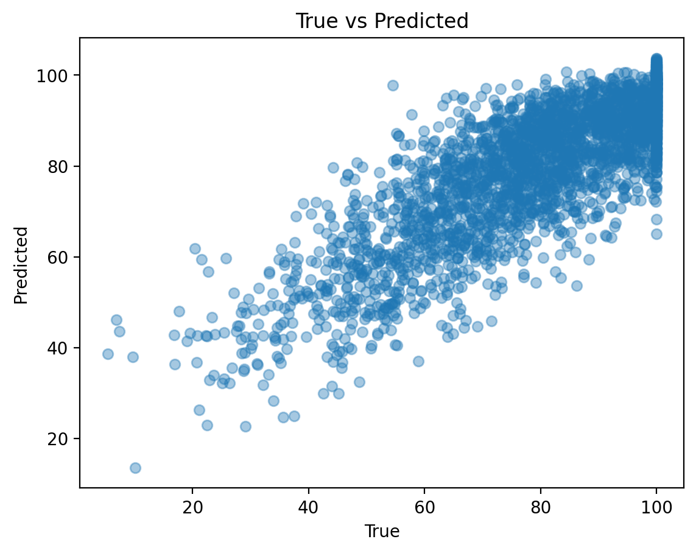
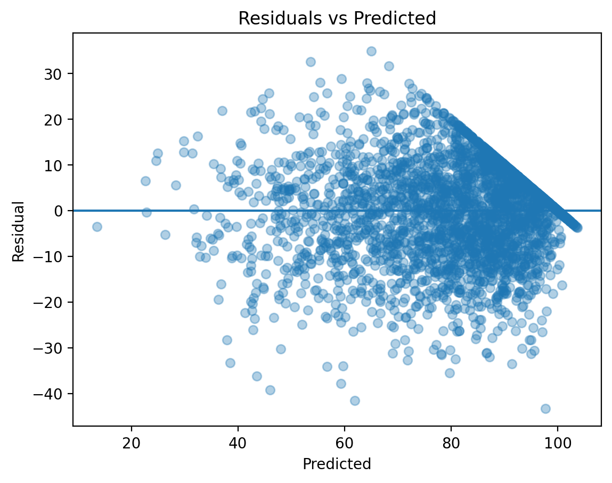
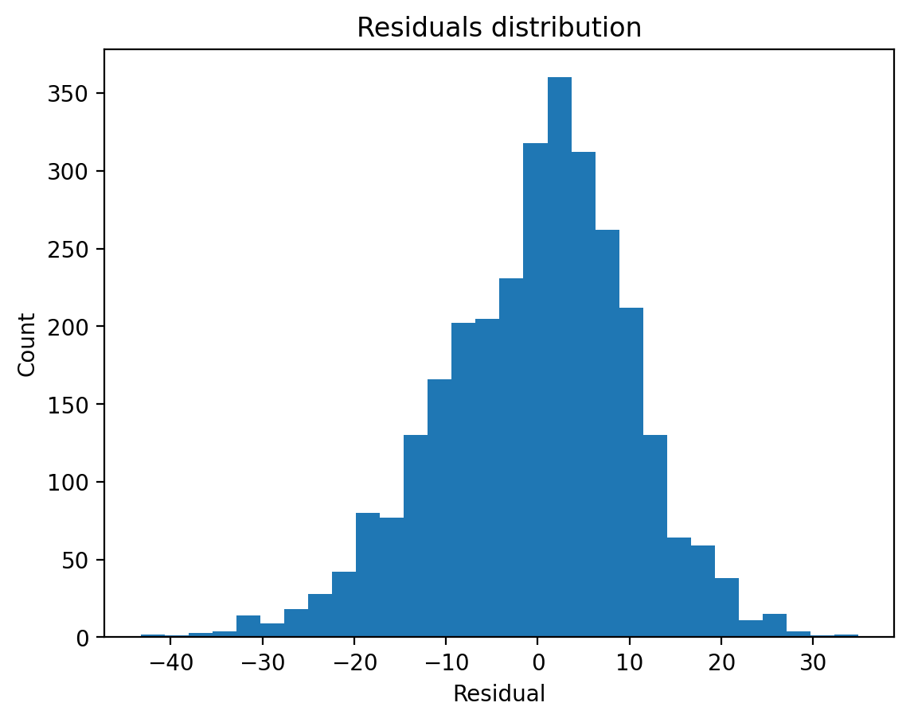

Digital Distraction vs Academic Performance (ML Project)

Goal: predict final_exam_score using students’ lifestyle and digital behavior features.

Dataset: Kaggle “Digital Distraction vs Academic Performance” (student_digital_life.csv), 15,000 records.

Models:

RandomForestRegressor (baseline)

HistGradientBoostingRegressor (best)

Results:

RandomForest: MAE = 8.644, RMSE = 10.935, R² = 0.657

HistGradientBoosting: MAE = 8.211, RMSE = 10.482, R² = 0.685

5-fold CV (MAE): 8.115 ± 0.121

Key factors (Permutation Importance, top):

study_hours_per_day

mental_health_status

sleep_hours

assignment_completion_percent

smartphone_usage_hours

motivation_level

class_attendance_percent

Artifacts:

figures/true_vs_pred.png

figures/residuals_vs_pred.png

figures/residuals_hist.png

figures/top_features.csv

notebooks/digital_distraction_baseline.ipynb
## Plots

